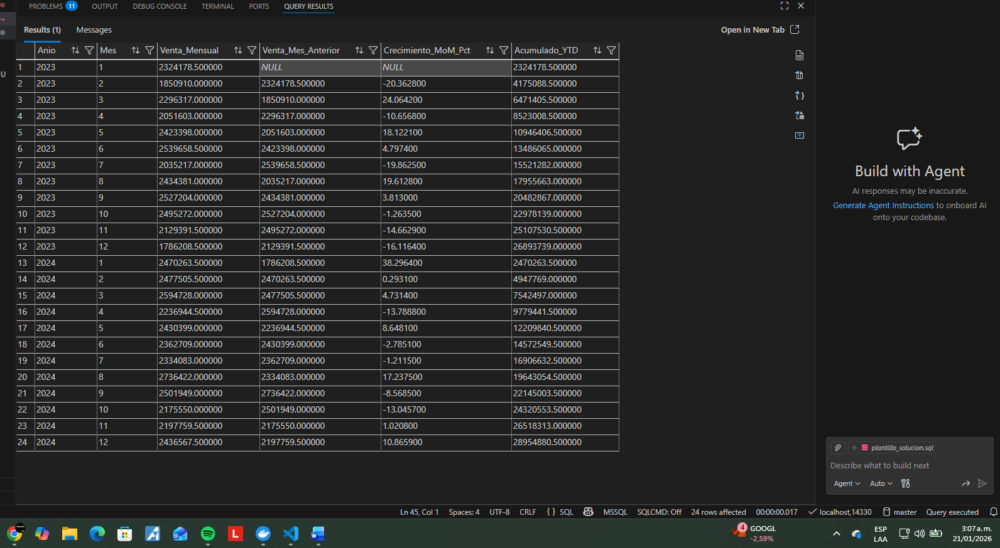

# Reporte Financiero - Crecimiento y Acumulados (YTD)
**Reto 7: The Financial Analyst Protocol**  
Diplomado en Gestión de Datos 2026 | SQL Avanzado (OLAP)

---

## Objetivo
Construir una **consulta SQL única** usando **CTEs** y **Window Functions** para transformar datos crudos en un reporte financiero con:

- Venta mensual
- Venta del mes anterior (LAG)
- Crecimiento MoM (%)
- Acumulado YTD (reinicia al cambiar de año)

---

## Fuente de datos
Tabla: `dbo.raw_sales_dump`  
Columnas principales: `ID_Transaccion, Fecha_Venta, Cliente, Producto, Categoria, Sucursal, Cantidad, Precio_Unitario, Descuento`

---

## Consulta SQL Final (CTEs + Window Functions)

```sql
WITH CleanData AS (
    SELECT
        UPPER(LTRIM(RTRIM(Cliente))) AS Cliente,
        CAST(Cantidad AS DECIMAL(18,4))        AS Cantidad,
        CAST(Precio_Unitario AS DECIMAL(18,4)) AS Precio_Unitario,
        CAST(Descuento AS DECIMAL(18,4))       AS Descuento,

        -- Total_Venta = Cantidad * Precio_Unitario * (1 - Descuento)
        CAST(Cantidad AS DECIMAL(18,4)) * CAST(Precio_Unitario AS DECIMAL(18,4)) * (1 - CAST(Descuento AS DECIMAL(18,4))) AS Total_Venta,

        YEAR(TRY_CONVERT(date, Fecha_Venta, 23))  AS Anio,
        MONTH(TRY_CONVERT(date, Fecha_Venta, 23)) AS Mes
    FROM dbo.raw_sales_dump
    WHERE TRY_CONVERT(date, Fecha_Venta, 23) IS NOT NULL
),
MonthlySales AS (
    SELECT
        Anio,
        Mes,
        SUM(Total_Venta) AS Venta_Mensual
    FROM CleanData
    GROUP BY Anio, Mes
)
SELECT
    Anio,
    Mes,
    Venta_Mensual,
    LAG(Venta_Mensual) OVER (ORDER BY Anio, Mes) AS Venta_Mes_Anterior,
    CASE
        WHEN LAG(Venta_Mensual) OVER (ORDER BY Anio, Mes) IS NULL
             OR LAG(Venta_Mensual) OVER (ORDER BY Anio, Mes) = 0
        THEN NULL
        ELSE
            ((Venta_Mensual - LAG(Venta_Mensual) OVER (ORDER BY Anio, Mes))
              / LAG(Venta_Mensual) OVER (ORDER BY Anio, Mes)) * 100
    END AS Crecimiento_MoM_Pct,
    SUM(Venta_Mensual) OVER (
        PARTITION BY Anio
        ORDER BY Mes
        ROWS BETWEEN UNBOUNDED PRECEDING AND CURRENT ROW
    ) AS Acumulado_YTD
FROM MonthlySales
ORDER BY Anio, Mes;

## Evidencia del reinicio del acumulado (YTD) al cambiar de año

La siguiente captura muestra claramente que el Acumulado_YTD se reinicia al pasar de diciembre a enero (cambio de año).




